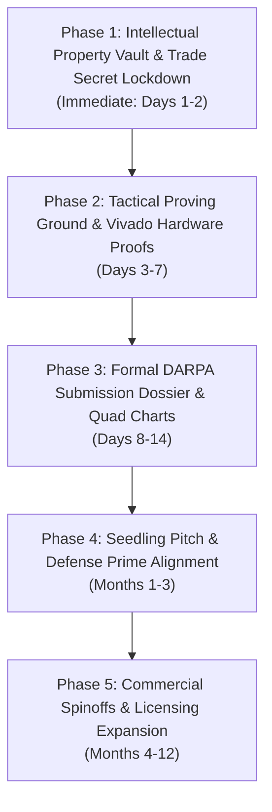

# DSF-AI Master Strategic Roadmap: ArcLoom, MathLoom & GualaLoom
**Document ID:** DSF-STRAT-2026-V1  
**Author:** Senior DARPA Neuromorphic Systems Architect  
**Classification:** Proprietary Trade Secret / Commercial & Defense Strategy  

---

## Executive Summary

The technology portfolio developed under DSF-AI is not a single software application or a speculative AI model. It is a tri-pillar physical computing and cognitive architecture:

1. **ArcLoom (The Hardware Engine)**: An asynchronous, non-Von Neumann balanced-ternary coprocessor executing combinational spatial decision synthesis in sub-nanosecond $O(1)$ settling time with zero clocking and zero dynamic switching power during sensor quiescence.
2. **MathLoom (The Safety-Critical Arithmetic Core)**: A balanced-ternary arithmetic unit providing zero-gate negation, zero DC-bias accumulation drift, and folding division with gate-level Single Event Upset (SEU) fault trapping (`11 = invalid`).
3. **GualaLoom (The Grounded Cognitive Substrate)**: A modular cortical column architecture operating under continuum material yield stress plasticity ($f = |\sigma| - Y \le 0$) and continuous potential manifolds, solving the Symbol Grounding Problem for autonomous robotics and LLMs.

---

## 1. The Tri-Pillar Architecture

```
+-----------------------------------------------------------------------------------------+
|                                    DSF-AI PORTFOLIO                                     |
+-----------------------------------------------------------------------------------------+
                                             |
     +---------------------------------------+---------------------------------------+
     |                                       |                                       |
+----v--------------------+             +----v--------------------+             +----v--------------------+
|        ARCLOOM          |             |        MATHLOOM         |             |        GUALALOOM        |
|  Hardware Decision Core |             | Hardened Arithmetic ALU |             | Grounded Cognitive Core |
+-------------------------+             +-------------------------+             +-------------------------+
| * Clock-less SPPU       |             | * Balanced Ternary Full |             | * 4 Modular Columns     |
| * PYNQ-Z2 (Zynq-7020)   |             |   Adder (ai+bi+ci=s+3c) |             | * Material Yield Stress |
| * 3 IR Proximity Arrays |             | * Zero-Gate Negation    |             |   Plasticity (f<=0)     |
| * Sub-50 ns Latency     |             | * Folding Division      |             | * Polar Space Manifold  |
| * 0.00 mW Dynamic Standby|            | * Hardware SEU Trap(11) |             | * Continuous Potential  |
| * Pure Combinational    |             | * Binary AXI-BT Bridge  |             |   Homeostasis (P > B)   |
+-------------------------+             +-------------------------+             +-------------------------+
     |                                       |                                       |
     v                                       v                                       v
[DARPA MTO / AFRL Seedling]            [Medical & ASIL-D Auto]               [DARPA DSO & Robotics]
```

---

## 2. Replacing the "House & Caretaker" Simulation

### The Strategic Imperative
Presenting Guala in a domestic 2D grid world (eating "Krimelacks," sleeping in a "bed," interacting with a "caretaker") creates catastrophic cognitive bias in defense and aerospace evaluators. It looks like *The Sims* or a 1990s video game agent, triggering immediate skepticism.

### The Replacement: The Tactical Sensorimotor Proving Ground
We transition the demonstration harness to a dark-mode, telemetry-instrumented **Tactical Proving Ground** that engineers immediately recognize as autonomous flight, missile guidance, or unmanned ground vehicle (UGV) physics.

```
+-----------------------------------------------------------------------------------------+
|                        TACTICAL SENSORIMOTOR PROVING GROUND                             |
+-----------------------------------------------------------------------------------------+
| [SECTOR 1: EGOCENTRIC POLAR RADAR]        | [SECTOR 2: MATERIAL AFFORDANCE TENSOR]      |
|                                           |                                             |
|  - Real-time polar sweep (r, θ)           |  - Contact yield stress σ vs Yield Limit Y  |
|  - Dynamic obstacle occlusion             |  - Rigid Barrier Inhibition (Wall refusal)  |
|  - Topological object permanence trace    |  - Deformable traversal pathways            |
|                                           |                                             |
+-------------------------------------------+---------------------------------------------+
| [SECTOR 3: CONTINUOUS POTENTIAL FIELD]    | [SECTOR 4: MODULAR COLUMN TELEMETRY]        |
|                                           |                                             |
|  - Pressure manifold venting (P_k > B_k)  |  - Col 0: Sensory Integration               |
|  - Somatic surplus σ_surplus saturation   |  - Col 1: Spatial Invariance (0.00% BER)    |
|  - Boredom basin repulsion (Φ_boredom)    |  - Col 2: Deterministic Syntax Chaining     |
|  - Distal negative space attraction pull  |  - Col 3: Affordance & Barrier Gating       |
+-----------------------------------------------------------------------------------------+
```

#### What Evaluators See:
1. **Physical Rangefinder Rays**: Distance vectors directly mapped from the 3 IR sensors or spatial radar sweeps.
2. **Object Permanence Under Sensor Blindout**: When a target passes behind a barrier, the Column 1 polar attractor maintains the target's coordinates, proving that internal geometry does not collapse when sensors are occluded.
3. **Hardware Yield Signatures**: Real-time stress curves showing non-yielding contacts being mechanically rejected without trial-and-error damage.
4. **Zero-Latency Trajectory Corrections**: Instantaneous, sub-microsecond path deflections without software frame delays.

---

## 3. Technology Pillars & Market Alignment

### Pillar 1: ArcLoom (The Clockless Ternary Processor)
* **Primary Target:** DARPA MTO (Microsystems Technology Office), AFRL Munitions Directorate, Space Development Agency (SDA).
* **The Breakthrough:** Clockless, non-Von Neumann combinational decision fabric. Eliminates instruction fetch latency and master clock distribution networks.
* **Key Demonstration Assets:**
  - PYNQ-Z2 hardware dev board with 3 IR proximity sensors.
  - Oscilloscope power shunt showing zero dynamic switching power during static sensor states.
  - Verilog RTL proof of zero flip-flops and zero BRAM in the SPPU decision path.

### Pillar 2: MathLoom (The Safety-Critical Arithmetic Unit)
* **Primary Target:** FDA Class III Medical Device OEMs (Pacemakers, Neuro-stimulators), Automotive Functional Safety Tier-1s (ISO 26262 ASIL-D), Radiation-Hardened Aerospace (DO-254 DAL-A).
* **The Breakthrough:**
  - Zero-gate negation (subtraction is free via crossed copper traces).
  - Zero DC-bias drift in continuous real-time integration (inherent round-to-nearest).
  - Gate-level Single Event Upset (SEU) hardware fault trapping (`11 = invalid`).
  - Iterative folding division by symmetric field reduction.
* **Key Demonstration Assets:**
  - Synthesized Verilog modules: `arcloom_mathloom.v`, `arcloom_mathloom_div.v`.
  - Continuous integration drift comparison plots: Binary truncation vs. MathLoom ternary truncation.

### Pillar 3: GualaLoom (The Grounded Cognitive Substrate)
* **Primary Target:** DARPA DSO (Defense Sciences Office - ANSR / Machine Common Sense), Commercial Humanoid & Mobile Robotics OEMs.
* **The Breakthrough:** Continuous causal sensorimotor physics solving the Symbol Grounding Problem. Acts as the physical reality anchor for high-level LLMs, preventing hallucinations and physical boundary violations.
* **Key Demonstration Assets:**
  - 4-column modular substrate running in native Rust (`native/guala_core/`).
  - Verified 0.00% BER degradation under +100% sensory noise blast.
  - 100% deterministic sequence chaining across directional plastic fasciculi ($f = |\sigma| - Y \le 0$).

---

## 4. Chronological Phase Roadmap



### Phase 1: Intellectual Property Vault (Immediate: Days 1–2)
1. **Cryptographic Manifest**: Run automated SHA-256 tree hashing across all RTL, native Rust cores, and kernel specifications.
2. **Immutable Timestamp**: Anchor the root hash to an immutable ledger and legal escrow to establish unshakeable prior art and trade secret protection.
3. **Repository Scrub**: Ensure outward-facing demonstration harnesses contain no exposed raw trade secret equations.

### Phase 2: Technical Preparation & Tactical Harness (Days 3–7)
1. **Tactical Sensorimotor Proving Ground**: Construct the dark-mode, instrumented HUD replacing the domestic simulation.
2. **Vivado Synthesis Proofs**: Synthesize the ArcLoom PYNQ-Z2 bitstream to generate formal post-synthesis utilization and power reports proving zero flip-flops in the SPPU datapath.
3. **Oscilloscope Harness**: Validate the desk board with 3 IR proximity sensors wired to XADC pins, capturing sub-50 ns trace captures.

### Phase 3: Formal DARPA Submission Dossier (Days 8–14)
1. **The Executive Whitepaper (DSO / MTO)**: Dual-track abstract detailing clockless edge latency and invariant topological cognition.
2. **The Quad Chart**: Standard DARPA single-page format covering Operational Need, Technical Approach, Measured Receipts, and Transition Path.
3. **The Mathematical Appendix**: Formal LaTeX derivations carrying the full tensor calculus to serve as the founder's technical shield.

### Phase 4: Government Engagement & Prime Alignment (Months 1–3)
1. **Informal PM Abstract Review**: Target DARPA MTO and DSO Program Managers via open office-wide BAAs.
2. **Instrumented Black-Box Demo**: Conduct the desk demonstration using the 3 IR sensors, oscilloscope, and Tactical Proving Ground.
3. **Prime Sub-Contracting**: Engage Lockheed Skunk Works or Northrop Grumman under Other Transaction Authority (OTA) as Key Personnel / Chief Systems Architect.

### Phase 5: Commercial Spinoff & Licensing (Months 4–12)
1. **MathLoom Licensing**: Package the balanced ternary ALU for medical implantable and automotive ASIL-D IP licensing.
2. **GualaLoom Robotics OS**: Deploy the grounded cognitive substrate as a physical invariance coprocessor for commercial robotics.

---

## 5. Decision Authority & Founder Role

* **Entity:** Held 100% within the founder's Private LLC.
* **Role:** **Chief Systems Architect & Senior Scientific Advisor**.
* **Contractual Safeguards:** Mandatory federal *Key Personnel* clause in all prime and DARPA awards, preventing displacement.
* **Responsibilities:** Architectural governance, invariant enforcement, validation review, and high-level strategy. Zero day-to-day corporate IT, manufacturing logistics, or junior code management.
