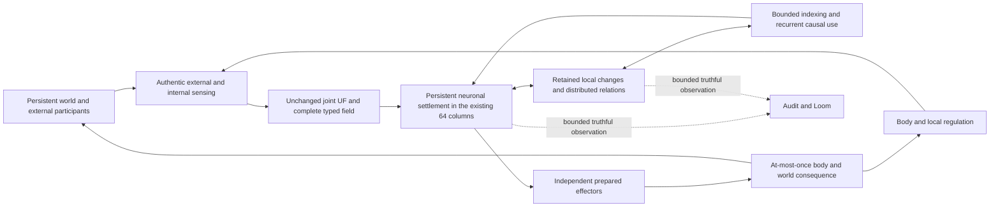

<!-- GUALA-SPEECH-01 authority notice, 2026-10-10 -->

**Reviewed speech design:** [GUALA-SPEECH-01 revision 1.0](../GUALA_SPEECH_LEARNING_SPECIFICATION.md) is the canonical development baseline requested by Joe after skeptical review. G1 is assigned implementation; A1 performs independent spot audits. SPEECH-EX01–06 authorize only the disclosed bounded native speech-learning/control mechanisms; earlier blanket ML prohibitions are superseded only within that scope. Full DSF, preserved history, truthful tests, retired-controller exclusion and financial L5 restrictions remain. This is development authority, not a product, performance, hardware-physics or ML-free certificate. The specification supersedes conflicting recommendations in the earlier speech hypothesis; dated text below remains historical to that extent. Broad reconciliation and product qualification remain OPEN.

# Reconciled functional design

This is the required design, not a claim that every connection works. G1 owns implementation; A1 audits the evidence. Requested architecture is one retained, bounded ArcLoom organism; current qualification is incomplete, so conflict is **yes**. Retired controllers, semantic answer stores and reduced field selectors must not be extended. The next engineering item is preserved-state functional qualification. Full-field relationships remain required; this document evaluates no reduced substitute.

## Functional-equivalence boundary

Use the existing 64-column ArcLoom architecture and the important cognitive mechanisms or their **functional equivalents**. Atom-by-atom or molecule-by-molecule reconstruction, a complete human mouth, a new chemical inventory, and a research-grade anatomical simulator are **not prerequisites** for nourishment, speech or this reconciliation. Preserve the unchanged full DSF field, deterministic causal operation, actual experience-dependent retained state, organism history and bounded execution. Functional equivalence does not authorize ML, heuristic pupil policy, canned answers, fabricated memory or softened tests.

A physical model used by the implementation must satisfy its own declared law and units. Auditing a broken historical material equation does not require replacing it with a more microscopic model. Use the smallest authorized mechanism that supplies the required causal function, specify it, and test that function. No additional physical model is ratified by this document.

## One causal architecture

This is a required causal map, **not a diagram of verified live connectivity**.
There is one cognitive authority. Transport, a caretaker, an evaluator, a
curriculum catalog and an observer may have their own engineering state; they
must not select the pupil's meanings or actions. Sleep/internal simulation
re-enters retained state with explicit internal provenance. It does not supply
a second truth about what occurred in the external world.

## Boundary contracts

| Boundary | Required state and transition | Rejected substitution and historical conflict | Preservation and acceptance |
|---|---|---|---|
| **B01 World → receptors** | Authenticated material/optical/acoustic/contact/body quantities, source location and clock. World objects retain quantity, pose and custody. | June object state machines emit descriptor trits; later eye keys consult scene targets. S59, S38. | Preserve world geometry and lawful material behavior independently. Vary the physical field without a semantic label and prove changed receptor state. Unavailable channels remain unavailable. |
| **B02 Receptors → joint UF** | The actual joint occurrence `(T,V,G,F,r,E)` in original units, derived coordinates, relevance and sparse contacts. One unchanged UF evaluation supplies distinct local perspectives. | Independent seven-sense kernels, normalized VTVR, missing-field proxies. S09, S10, S21, S36. | Independent operator/order fixtures, explicit units and clocks; no kernel edit. Resolve SC05's global stability authority conflict before certifying consistency. |
| **B03 UF → neuronal dynamics** | All seven fields and the separate applicable global stability state retain exact values, types and causal relationships; finite kernel results are lifted exactly downstream. | Sign hashes, one score, one trit, or seven untyped scalars presented as full neuronal effect. S23, S43. | Trace each field into its specified physical effect with the loaded source/binary. Merely serializing it is insufficient. |
| **B04 Neuron/contact transition** | One persistent local Psi/Krimelack fabric, specified gate/contact/membrane relationships, local work, recovery and retained plastic change. | Winding as ion current, free dimensionless gains, error-learning-rate updates and reciprocal work omitted. S22, S23, S41–43. | Use the ratified local law and its units; prove complementarity, reciprocal accounting, refusal and continuation. No new numerical law is invented by this design. |
| **B05 Settlement → retained change** | Sparse complete causative neuron-state change across the definitive quiescent boundary, plus necessary source and relation provenance. | Instantaneous tensor called a mosaic; silent ordinary steps called consolidation; input archive called memory. S29, S31–32, S37. | Reconcile old retention timing against the definitive rule without relabeling bytes. Prove persistent change and later causal use after the original stimulus is unavailable. |
| **B06 Distributed retention/indexing → recall** | Bounded navigation reaches physically retained episode components and supports recurrence/reassembly from a lawful partial cue. | Window/sibling database return, nearest example, semantic lookup, prescribed parent levels. S13, S24–25, S31. | Index addresses are storage/navigation, never the answer. Retained state must cause changed reassembly and action; severing it must remove that contribution. Preserve relation order without scanning the whole brain. |
| **B07 Body/local fluid → modulation** | Actual deficit, transport/recovery and local influence on named physical targets. Functional equivalents remain within the current scope. | Global mood multipliers, invented species/coefficients, fixed needs-to-action policies. S17–18, S53. | Account units and local transfers; prove body cause → neuronal effect → retained/use consequence. No unnecessary molecular reconstruction and no second cognitive owner. |
| **B08 Cognition → effectors** | Actual settlement prepares independent motor/vocal commands; command provenance identifies the producing neuronal state. | A Python or Rust rule selects a behavior before passing one option to a chooser. Task1598 M01. | Inspect the producer, not just option count. Demonstrate multiple physically possible continuations can depend on retained experience without authored action priorities. |
| **B09 Effectors → world → re-entry** | At-most-once application, actual pose/contact/material result, complete measured sensory return and one causally consistent successor. | Fixture teleportation, discarded angular feedback, a reported movement that never occurred, external caretaker action counted as pupil action. S47–48. | Bind intent, actual displacement, proprioceptive/vestibular return and persistence. Separate environmental obstruction, internal attractors and observer overhead. |
| **B10 Experience → sleep/internal use** | Real rest/sleep state, internal provenance, lawful retained-relation re-entry/reorganization, later recall/use. | Count-sorted dictionary replay, blanket decay or a scheduler label as consolidation. S15, S37, S52; Task1598 M07. | Compare retained relations before/after and next-day use, preserve internal/external provenance and prove cold continuation. A silent interval is only a silent interval. |
| **B11 Warm → cold continuation** | Same causative brain, body, world, source lineage, consumed actions and current-only authoritative checkpoint survive. | Same UUID/tick attached to genesis; replay-distilled summary presented as retained neural memory; unread old files claimed as migration. S16, conversion report. | Exact source/codec custody, complete retained-state mapping and same next-transition evidence. No automatic historical rollback or synthetic fill for missing state. |
| **B12 Organism → observation** | Bounded event-derived facts about received sensing, actual state/action/consequence and unavailable functions. | Full-world polling, invented attention, static cognitive panels or model assertions returned as live measurement. S61, S64. | Bind displayed values to the same release and receipts; measure observer cost separately. Real browser checks are required when qualifying a changed live UI, not for this offline historical reconciliation. |

Sources: [version register](documentation-sources.md), [specification clauses](specifications.md),
[exact-image mechanism evidence](mechanisms_task1598.json).

## Whole-organism design responsibilities

These are interacting responsibilities, not new modules, neuron quotas or
fixed anatomical assignments. Together they map every row in the
[53-responsibility inventory](capabilities.md). The named biological role is a
functional analogy that must be connected to actual physical participants.

| Design responsibility | Inventory rows | Reconciled design and minimum distinguishing evidence |
|---|---|---|
| **D01 Reception and sensory organization** | C16, C17, C47 | Lawful specialized receptors and connected local participants receive the actual external/internal quantities. Distinguish seen/heard/touched from world metadata and unavailable lanes. Prove a physical input difference propagates, retains where claimed, and later affects behavior. |
| **D02 Contextual experience and association** | C03, C05, C41, C48, C49, C51 | Shared causal occurrence binds external senses, body, activity, place/order and consequence without phylum labels or forced multimodal keys. The same object in changed context can form different relations; different objects sharing one quality need not collapse. |
| **D03 Retention, recurrence and recall** | C01, C04, C07, C19, C20 | Neuronal changes persist; sparse indexing supports distributed recurrence rather than supplying answers. Recognition is a changed physical response, recall is later reassembly/use. Demonstrate cue-only use, novel context and cold continuation independently. |
| **D04 Working state, attention and habituation** | C06, C08, C18 | Bounded current dynamics determine physical participation and orienting. Adaptation must have a specified local cause. An attention flag or dwell counter is not attention or habituation. Preserve quiet participants without sweeping every neuron. |
| **D05 Order, prediction and deliberation** | C09, C21, C26 | Retained relations influence possible next transitions with ordered causal provenance. A serialized plan or ranked route does not qualify. Distinguish prediction before outcome, update from actual consequence, and physical action preparation. |
| **D06 Motor action, procedure and navigation** | C27, C28, C38, C39, C50 | Actual settlement drives independent effectors, movement/manipulation changes the world, and measured consequences return. Learned procedures must survive moved goals, varied context and cold restore without a stored answer recipe. |
| **D07 Articulation, comprehension and syntax** | C02, C29, C30, C52 | Learned ordered sensory/motor relations support comprehension and physical voice, including self-hearing. Distinguish reproduced waveform, imitation, grounded meaning, compositional use and spontaneous communication. Catalog syllables and cosine/reward selection cannot supply those conclusions. |
| **D08 Regulation, affect and local fluid** | C14, C22, C23, C24 | Body/internal state affects named neuronal/contact targets locally and with declared units. Amygdala/affect and fluid roles are neither global utility weights nor another mind. Current chemistry detail remains unratified where its authority is missing. |
| **D09 Needs, wants, boredom and curiosity** | C25, C42, C43, C44, C45, C46 | Preserve the distinct requested responsibilities. Body deficit, structural uncertainty/cohesion and reachable potential must act through the same specified dynamics. The exact operator for wants and several current motivational claims remains unresolved; this document supplies no invented substitute. |
| **D10 Self, others and social experience** | C13, C31, C32, C33 | Retain self/body continuity and source distinction, joint attention and learned relations to other participants. A participant ID proves custody, not understanding another's state. Require changed behavior from actual shared experience without scripted social lines. |
| **D11 Sleep, background activity and consolidation** | C34, C35, C36 | Internal activity can continue while external action changes; real sleep/rest and retained reorganization are distinct. Prove internal provenance, bounded work and later use. Do not call five ordinary ticks with zero sleep pressure consolidation. |
| **D12 Imagination, reflection and creativity** | C10, C11, C15, C40 | Internally initiated bounded reuse/recombination of lived relations, monitored against actual consequence, without replacing external truth. Historical reflection classes that are never called are source candidates only. Novel output must not come from a hidden transcript or answer catalog. |
| **D13 Autonomy, play and integration** | C12, C37 | Whole-organism participation and endogenous exploration share the same retained state and loop. A tutor may offer experiences; it may not select the pupil's response. Preserve the narrow July action-reuse witness without enlarging it to novel invention or current live play. |
| **D14 Food availability and provision** | C53 | The world exposes remaining edible material, contact/transfer possibilities and new externally accounted supply. Cognition receives physical experience of these conditions. Provisioning is environment behavior; foraging is the pupil's learned causal behavior. |

## Eating and remembered foraging: the required chain

The user's example maps to an ordinary causal chain rather than an apple-specific
rule. A real body deficit changes internal sensing. Earlier eating has produced
retained changes linking encountered sensory material, contact/mouth action,
intake and changed bodily state. Seeing a caretaker use a ladder is another
multisensory episode with participant, order, body and world context. Later
partial cues can re-enter those relations; planning must use them through the
same neuronal dynamics to prepare a possible continuation. The pupil attempts
an action, encounters its actual result and retains the consequence.

This chain does not require a `Tapestry` class, a ladder recipe or an apple
dictionary. A test named after an apple tree is not itself a violation: an
environment can contain apples and a ladder. The violation is a fixture or
controller supplying the intended cognitive answer and then calling it learned
foraging. An independent experiment may arrange the environment and measure
the outcome; it must not preload the pupil's answer.

Consumption must reduce actual edible availability and account for transferred
material. A nonedible core may remain if modeled honestly; a zero-nutrition
object must not remain selectable as edible food. Reappearance elsewhere is
an explicit provision from the environment's source, with new location and
custody. Neither material nor foreknowledge appears secretly inside cognition.
Specific rates, thresholds and stock choices in S45 are not derived merely
because the intended function is obvious.

## Development and acceptance

For the selected repair, bind the authorized function, inputs/outputs, units, persistent state, complete DSF participation, resource bounds and failure behavior to the exact implementation. Follow specification/design → development → unit → module → system → exact release/rehearsal → live verification. Independent fixtures test the law; connected tests test actual handoffs; system tests establish retained causal use. A missing function stays missing rather than being replaced by a scripted answer.

Use the existing mechanism when it lawfully supplies the function. Replace an incompatible mechanism directly; do not build an adapter around forbidden decision authority. The [speech decision](speech-decision-record.md) separates hearing, retained recognition, vocal control, actual pressure, intelligibility, grounding and syntax. A natural child-like voice is a separate performance requirement from basic intelligibility.

Retained state and matching physical next transitions qualify preservation. An archive, UUID, tick, contact count or class name does not. Missing historical authority is an evidence gap, not permission to redesign the kernel. Current-source gaps and their exact repairs are in [Task1606](task1606-boundary-reconciliation.md) and the [native audit](current-native-speech-audit.md).

The [212-clause crosswalk](specifications.md), [53-responsibility inventory](capabilities.md), [historical change register](change-classification.md), [source-family evidence](coverage.md) and [eighteen repair actions](remediation-plan.md) retain the detailed reconciliation. Earlier repeated compilation text is preserved in the publication backups; no source-family finding or structured obligation has been deleted.
