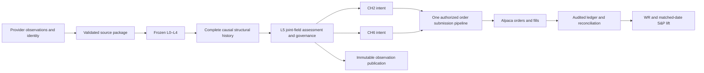

# TFE consolidated system specification

**Document:** TFE-SPEC-20260923 • **Version:** 1.0 review draft • **Date:** 23 September 2026  
**Architect:** Joseph Forrester • **Scope:** TFE, CH2, CH6 and supporting investment processes  
**Status:** Complete system-scope contract and evidence map; not certification that the requested strategy is implemented or its performance achieved.

This document consolidates what the system must do, what inspected code actually does, and the definitions still required. An open definition is not executable physics. No placeholder operator, report, source comment, or document title establishes an implementation or a measured result. The open definitions in §18 prevent an honest claim of complete executable strategy semantics.

This specification does not deploy, authorize orders, replace frozen L0–L4, modify recommendations or screener, or interrupt Guala. Proposed contracts below require implementation and verification before being described as active behavior. Writing this document does not ratify conflicting historical rules.

## Contents

1. Purpose and success criteria
2. Authority and evidence
3. Architecture and boundaries
4. Source data and provider contracts
5. Kernel input and complete structural evidence
6. Temporal and cross-symbol structure
7. L5 governance and decision evidence
8. CH2 lifecycle
9. CH6 lifecycle
10. Order execution and reconciliation
11. Refresh and publication
12. Recommendations, screener and observation
13. Measurement and benchmark accounting
14. Historical recovery evidence
15. Verification and acceptance
16. Resources, security and operations
17. Current implementation map
18. Unresolved definitions and decisions
19. Delivery sequence and change control
20. Source register and traceability

## 1. Purpose and success criteria

**TFE-001.** TFE is a domain-specific proving ground for deterministic structural perception. L0–L4 interprets ordered observations without knowing that they are financial. L5 supplies financial meaning and operational governance. The account is the measurement apparatus.

**TFE-002.** The requested operating purpose is to recognize structures preceding favorable movement and recognize deterioration in time to harvest that movement. CH2 addresses longer upward structures; CH6 addresses short-duration downward opportunities with the user's cash-grab objective. Similar-symbol evidence must remain identifiable and causal.

**TFE-003.** The current user objective is approximately **63% closed-position WR and +15 percentage points of portfolio return over S&P/SPY for each channel**. Earlier project documents' 85% floor and 83–87% claims describe different expectations or measurements; they must not silently replace this task's objective.

**TFE-004.** Results must distinguish structural observations, positive forward-return signal rates, executed net position WR, and portfolio lift. None implies the others. Deterministic computation does not establish perfect knowledge of future external inputs.

**TFE-005.** No ML, fitted scalar surrogate, outcome-tuned kernel, averaged tuple, hidden threshold, bucket lookup, or independent component gate may substitute for the requested joint-field assessment. Statistical summaries may describe evaluation results; they are not decision authority.

## 2. Authority and evidence

**TFE-010.** Current explicit user instructions govern the work. The user has protected recommendations, screener, and frozen L0–L4; Guala has priority. Historical documents and claimed prior approvals do not override those instructions.

**TFE-011.** Every architectural or performance statement must carry an evidence class:

| Class | Meaning | Does not establish |
|---|---|---|
| Requested | Explicit user requirement | Existing implementation |
| Source verified | Inspected executable source at a recorded hash | Deployment or successful execution |
| Run verified | Reproducible run, exact inputs and outputs retained | Live parity or future performance |
| Live verified | Dated task definition, running image/process and relevant data observed | Later unchanged state |
| Historical claim | Document or report assertion | Reproduction |
| Proposed | New contract awaiting applicable review | Ratification or deployment |
| Open | Missing definition or evidence | Permission to invent a substitute |

**TFE-012.** A frozen kernel version is identified by source/configuration hashes and the exact invoked entry point. A side kernel using the same tuple names is a different authority until equivalence is established. Binary64 output encoded exactly as a rational remains the exact encoding of a binary64 result; it does not prove rational arithmetic inside the kernel.

**TFE-013.** Historical trade reconstruction starts with the `personal_trade_ledger` audit record identified by the Lessons Learned specification. Its actual completeness must be checked against broker order/fill identities. If unavailable, disclose that before presenting a broker reconstruction or local paper book. Do not merge those records into one supposedly canonical ledger.

**TFE-014.** This document makes no new live-state assertion. Source hashes and the documentation-time commit are in [source_manifest.json](source_manifest.json). Earlier dated deployment reports remain dated evidence only.

## 3. Architecture and boundaries



The diagram is the requested contract, not a claim that all arrows currently exist.

**TFE-020.** Source preparation validates identity, dates, units, adjustment conventions and availability. It must not pre-smooth, average, label, or score observations before L0.

**TFE-021.** Frozen kernel internals remain unchanged even where historical equations and current source differ. Record differences; do not repair them by silently redefining L5 inputs.

**TFE-022.** L5 consumes structural evidence and produces separately identified structural assessments and domain actions. It cannot write backward into kernel values, timestamps or historical evidence.

**TFE-023.** Broker feasibility, cash coordination, publication health and structural meaning are separate concerns. An unavailable quote or rejected order is not structural collapse. Operational coordination must not become an invented selector.

**TFE-024.** ArcLoom, L6 and Guala documents are references, not automatic dependencies. No relation lock, hardware settling event, or entropy threshold is equated to a ticker's future rise or collapse without an explicit verified mapping.

## 4. Source data and provider contracts

**TFE-030.** Every source package records provider, endpoint/product, request interval, retrieval time, instrument identity, source timestamps, adjustment convention, payload digest and validation outcome. Credentials are excluded from artifacts and logs.

| Source | Inspected role | Unverified boundary |
|---|---|---|
| Massive / Polygon | Daily aggregate prices, volume and ticker reference; `tools/ch4_store_refresh.py` | Universe completeness, per-symbol missing sessions, historical adjustment revisions |
| Alpaca | Order interface in `alpaca_bridge.mjs`; calendar in refresh tool; latest trades in CH6 code | Current account mode, deployed callers, entitlements, fill reconciliation |
| PostgreSQL runtime | Latest/historical structural snapshots and normalized fundamentals | Actual publication coverage and complete historical point-in-time fundamentals |
| Local parquet stores | Cached raw observations and structural tapes | They are not broker fills or a complete source-history guarantee |
| User-named “tivali” | Name retained as supplied | Provider identity and integration not established in the inspected source; no substitute name assumed |

**TFE-031.** Instrument identity must survive ticker changes, aliases, share classes, corporate actions, IPOs, halts and delistings. Symbol-string equality alone is insufficient proof of continuity. Unknown mappings remain unknown.

**TFE-032.** Daily bars require a declared exchange calendar, timezone and completed-session cutoff. A retrieval date or database publication date is not the bar's observation date. A legitimate session without a trade is distinguished from a failed fetch or incomplete archive.

**TFE-033.** The package must reject conflicting duplicates, nonfinite or invalid required values, impossible ordering and ambiguous instrument identity. Zero volume, absent volume and provider omission are different states. Do not manufacture bars by padding or forward filling kernel inputs.

**TFE-034.** Adjusted and unadjusted prices must never mix silently. Revised historical prices invalidate derived caches from the first affected observation. Preserve prior source versions for reproduction. Whether a backtest uses contemporaneously known adjustments or later-restated history must be disclosed.

**TFE-035.** Refresh is additive/idempotent with explicit correction provenance. Validate a proposed store before atomic publication; serialize writers. A failed refresh cannot overwrite a valid store or claim fresh coverage. A successful grouped-day response does not certify every ticker's history.

**TFE-036.** Fundamentals, sector classifications, borrow availability and company events must include their knowledge timestamps where used historically. Present-day eligibility is not historical eligibility. Lack of point-in-time data limits the claim, rather than licensing lookahead.

## 5. Kernel input and complete structural evidence

**TFE-040.** For decision cutoff `t`, pass only the admitted raw history known by `t` into the frozen kernel entry point. Record the input beginning, endpoint, row count, ordering, source identity and hash. A bounded history is not a whole-listing history unless verified as such.

**TFE-041.** The explicit field is

`F = (D_k, M_k, R_rev_k, U_star_k, C_k, P_k, B_k)`.

Keep every field with its native values, index, time support and meaning. Preserve `S_UF` and `R_UF` as separately identified context where supplied. `R_rev_k`, resonance `R_k` and global `R_UF` must not be interchanged because documents abbreviate them similarly.

| Field | Source meaning used for custody | Prohibited inference |
|---|---|---|
| D_k | Directional sign of resonance change | Price must rise when positive |
| M_k | Curvature/motion of resonance | A price acceleration estimate without a mapping |
| R_rev_k | Structural reversal indicator | Standalone exit instruction |
| U_star_k | Kernel uncertainty/instability output | Calibrated probability of loss |
| C_k | Native complexity/cardinality output | An invented cohesion energy |
| P_k | Directional discontinuity/persistence stress | Market price or volume pressure by naming alone |
| B_k | Bounded structural potential state | Independent profit target or sufficient entry gate |

These are custody semantics. They do not replace the kernel or define the missing joint decision rule.

**TFE-042.** Preserve the entire supplied L4 history as known at each cutoff, gate/support identity, and available upstream provenance. Explicit fields take precedence over reduced `decision_vector` surfaces. Never fabricate a missing C_k or context value.

**TFE-043.** The current kernel's historical output is not assumed prefix-stable. Independent-prefix inspection already found revisions to earlier gate values after new observations. Therefore a final-history run must not be treated as historical knowledge. Recompute causal prefixes or demonstrate exact cache equivalence for the proposed reuse.

**TFE-044.** Evidence envelope, proposed logical schema:

```text
StructuralEvidence
  schema_version, evidence_id, kernel_source_hashes, kernel_config_hash
  instrument_id, source_package_id, observation_cutoff, knowledge_cutoff
  raw_input_start, raw_input_end, raw_input_digest, input_count
  ordered_structural_records[]
    native_record_id, native_support_interval, field_values[seven named fields]
    available_L0_L3_provenance, missing_fields[]
  context {S_UF, R_UF, origin_and_aggregation_definition}
  availability, completeness_result, source_dependencies[]
```

The schema names a contract, not an already deployed table. Identical field values with different timestamps or histories do not imply identical structures.

## 6. Temporal and cross-symbol structure

**TFE-050.** The object of assessment is an ordered evolving field, not its last tuple alone. A structure's temporal support must be explicit. Representation must retain all required coordinates and relationships; a signature, distance, neighbor WR or cell key cannot acquire authority merely by retaining a copy of the original tuple alongside it.

**TFE-051.** Formation, persistence and impending collapse are distinct structural states. Price peaks and valleys may label outcomes retrospectively but cannot enter an earlier decision. A profitable historical interval does not by itself define its causal precursor.

**TFE-052.** Similar-symbol assessment must declare peer identity, causal availability, structural relationship, time alignment and all discarded information. Same sector, low Euclidean distance, shared scalar direction or common price movement is not automatically the user's intended structural similarity.

**TFE-053.** Peer evidence cannot include unresolved future outcomes. If one stock lacks observations at the comparison cutoff, its absence must remain explicit. The comparison must not quietly select only surviving or successful peers.

**TFE-054.** The precise structural episode boundaries, full-field formation/collapse relation and peer-comparison law are open definitions D-01 through D-03. This specification does not insert scores or condition ladders to fill them.

## 7. L5 governance and decision evidence

**TFE-060.** L5 must be deterministic for identical evidence and approved governance state. Deterministic does not mean physically derived: all operators require an identified derivation or explicit approved domain rule.

**TFE-061.** Each assessment must identify channel, cutoff, evidence references, structural state, the exact authorizing joint relationship, governance disposition and rule version. It must distinguish `structural_unknown`, `structurally_inadmissible`, `operationally_unavailable`, `eligible`, and `existing_position_review`.

**TFE-062.** Decision record, proposed contract:

```text
Assessment
  assessment_id, channel, observation_cutoff, knowledge_cutoff
  instrument_id, evidence_ids[], peer_evidence_ids[]
  structural_state, structural_relation_witness, relation_version
  governance_rule_ids[], disposition, explanation
  proposed_action, earliest_execution_time
  source_code_hash, configuration_hash
```

Until D-01/D-02 are resolved, do not implement a dummy witness or call a scalar score a relation witness.

**TFE-063.** L5 admissibility must not reintroduce ML, weighted tuple compression, heuristic smoothing or outcome-tuned thresholds. The user's CH6 cash-grab rule is domain governance, not permission to replace structural entry selection.

**TFE-064.** The historical SPY D_k macro exception is recorded in Lessons Learned. Its scope is a market-level cohort condition, not per-ticker selection. Applicability to the final CH2/CH6 laws requires reconciliation with the current instructions; it is not silently enabled here.

**TFE-065.** Parameter registry entries require exact rule, units, derivation, scope, authority, effective date, version, verification and withdrawal condition. A historical approval claim is evidence to reconcile, not blanket permission for a new deployment.

## 8. CH2 lifecycle

**TFE-070.** CH2 seeks favorable longer upward structure. Required sequence: causal observation → full-field formation assessment → domain admissibility → order intent → acknowledged fill → continuing structural reassessment → governed exit → ledger reconciliation.

**TFE-071.** Continue observing an open position through every required structural update. The exit must be supported by the approved whole-field deterioration/collapse law, or a separately identified authorized operational/domain instruction. A elapsed-day cap, standalone B_k threshold or scalar basin label is not automatically that law.

**TFE-072.** Proposed state machine:

`OBSERVING → ELIGIBLE → ENTRY_PENDING → OPEN → EXIT_PENDING → CLOSED`

Rejection, partial fill, cancellation and operational unavailability are explicit branches. A signal is not an order; an accepted order is not a fill. Restart restores actual state rather than replaying entry side effects.

**Current source evidence:** `web/scripts/execution/ch2_strategist.mjs` uses V3 basins, minimum history/capitalization and a B_k carry threshold. `sentinel_monitor.mjs` contains several exit paths and a disabled exhaustion timer. These are existing reduced mechanisms, not certified fulfillment of TFE-050–071. Do not restore or remove a particular exit solely because a historical document praises or condemns it.

## 9. CH6 lifecycle

**TFE-080.** CH6 seeks short-duration downward structures. It is not defined as buying the inverse of CH2, or shorting every `Avoid` label. It requires its own explicit full-field entry relation, expected structural continuation and invalidation condition.

**TFE-081.** The user requires a percentage daily cash-grab target. Inspected `tools/ch6_fast_harvest.py` records a **2% end-of-day banking rule**, plus 5% intraday arming, one-percentage-point giveback, 20% adverse trigger and five-session backstop. These are source-recorded settings, not newly approved values or proof of current broker behavior. Their final authority and interaction are D-04.

**TFE-082.** A short target is measured relative to the declared entry basis. For raw short price gain, `g = (entry_price − exit_price) / entry_price`; net P&L additionally includes fees, borrow and other actual costs. Reaching a target in a daily high/low does not prove a fill or its ordering relative to a stop.

**TFE-083.** Intraday harvesting requires timestamped observations adequate to establish trigger and fill order. Daily-close controls must be labelled daily-close approximations of execution, not intraday parity. A percent target is a trigger, never a guaranteed fill price or loss bound.

**TFE-084.** Verify shortability, borrow evidence where available, account permission, existing positions and execution feasibility separately from the structural verdict. Model unknown borrow as unknown; record whether a replay is borrow-constrained or unconstrained.

**Current source evidence:** `ch6_fast_harvest.py` explicitly declares reduced event screening; `ch6_pool.py` uses reduced damage/turnover rules. Other CH6 studies use a distinct kernel path and incomplete field exports. The local CH6 book is paper accounting unless verified against broker fills. None proves a complete shared-kernel structural entry law.

## 10. Order execution and reconciliation

**TFE-090.** Exactly one authorized order-submission pipeline must own external orders. Enumerate every capable caller, scheduled job, retry and manual endpoint before claiming enforcement. Offline replay and paper bookkeeping must never submit orders.

**TFE-091.** Each order intent binds channel, instrument, assessment, account mode, quantity, order type, authorized price/stop terms, idempotency identity and cutoff. Same-ticker collisions, retries and concurrent channels require explicit ownership rules. Those rules may coordinate scarce cash but cannot fabricate structural preference.

**TFE-092.** Account state must be reconciled with broker acknowledgments and fills. Handle partial fills, rejection, cancellation, replacement, corporate actions and recovery after uncertain submission. A network timeout is not evidence that an order failed to reach the broker.

**TFE-093.** Cash and reservation updates must be atomic under concurrent intents. A repeated worker cannot spend the same available cash twice. Capital allocation amounts, deployment cadence, same-day re-entry and position caps require approved rules; this specification adds none.

**TFE-094.** The trade ledger records full order/fill chronology, position basis, costs, realized/unrealized P&L, source assessment, rule versions and reconciliation status. An audit event cannot silently replace a fill record. Corrections remain traceable.

**TFE-095.** Entry halt and exit authorization are independent controls. Verify every order-capable path and current account environment. Never infer halt state from a local deploy-script default. No halt, order or account setting changes are authorized by this documentation work.

## 11. Refresh and publication

**TFE-100.** Refresh stages are explicit: source acquisition → validation → causal structural computation → governance assessment → publication validation → atomic activation. Optional enrichment cannot silently alter the already assessed evidence or block required source truth indefinitely.

**TFE-101.** Each stage records input/output identity, start/end, status, resource usage and failure reason. A failed stage cannot be labelled complete because its parent process exited normally. Retry resumes from verified immutable inputs rather than silently mixing runs.

**TFE-102.** Published bundles bind source version, kernel version, governance version, cutoffs, schema and assessment results. A consumer must not combine a latest tuple with fundamentals or a decision from an unidentified different bundle.

**TFE-103.** Historical source correction triggers invalidation/reassessment of affected derived artifacts. Downstream reuse requires identity equality, not filename equality or matching last-row prices alone.

**TFE-104.** Current `run_refresh_with_l5_learning.py` contains legacy learning/oracle orchestration. Its presence is not approval to run those stages. Inspect actual configuration/call graph before invoking a wrapper whose defaults may train, promote, publish or submit.

## 12. Recommendations, screener and observation

**TFE-110.** Recommendations and screener, including behavior-changing shared dependencies, are protected from modification in this task. Any future integration requires explicit scope and review.

**Source verified:** recommendations page delegates to `RecommendationsQuickCheck`; `/api/recommendations/list` selects stored `Accumulate` rows, requires sector and seven finite fundamental fields, then orders by market capitalization and ticker. It is not itself the full-field selector.

**Source verified:** `sync_runtime_postgres_impl.mjs` invokes `tuple_proximity_engine.mjs`; that engine normalizes seven-coordinate ranges, selects thirty nearest neighbors by Euclidean distance, counts positive twenty-session returns and uses 0.65/0.40 label thresholds. This is a reduced proximity method. Its name/comments do not establish full-field physics.

**TFE-111.** Observation should expose source date, publication date, rule version, actual channel status, unknowns and evidence links. A descriptive tag is not a verified structural class. A displayed recommendation is not evidence of an order or fill.

## 13. Measurement and benchmark accounting

**TFE-120.** A benchmark manifest fixes universe construction, membership dates, interval, source versions, channel rules, capital, sizing, costs, execution assumptions and benchmark convention before the assessed run. Every exclusion and censored outcome is reported.

**TFE-121.** Net closed-position win rate:

`WR = 100 × count(closed positions with net realized P&L > 0) / count(closed positions)`.

Zero-P&L positions remain in the denominator and are not wins. Open positions are excluded from WR and marked in portfolio equity. Partial-fill aggregation and position boundaries must be declared consistently.

**TFE-122.** For a no-external-flow account, `R_strategy = 100 × (ending_equity / starting_equity − 1)`. Equity includes cash, long marked assets, short liabilities, collateral and accrued costs without double counting. External deposits/withdrawals require a declared cash-flow-adjusted return method; do not count deposits as performance.

**TFE-123.** `Lift_pp = R_strategy − R_SPY` over identical dates and capital convention. Lift is percentage-point excess return, not WR difference, average trade return, relative percentage improvement or profit divided by benchmark profit. Declare SPY price versus total-return treatment and dividends on both sides. SPY is a benchmark proxy, not automatically identical to every S&P index series.

**TFE-124.** A completed-close decision fills no earlier than a subsequent executable observation. Same-close retrospective fills, using future endpoint outcomes in historical libraries, forward-return entry filters and current fundamentals applied historically are prohibited lookahead unless explicitly scoped as noncausal diagnostics without performance claims.

**TFE-125.** Borrow costs, commissions, slippage, dividends owed on shorts and actual execution constraints must be included or declared unavailable. Existing fee heuristics in `ch_desk.py` are model assumptions, not verified broker charges.

**TFE-126.** Daily equity includes every benchmark session. Missing held-position marks must be resolved or explicitly prevent a certified result; never silently omit losing names or days. Coverage-selected diagnostic cohorts must be labelled as such.

**TFE-127.** Freeze a candidate before evaluating an untouched confirmation interval. Report all declared variants, both channels separately, closed/open counts, drawdown, exposure, dates and exclusions. No achieved-target claim from the best retrospectively selected slice alone. Minimum evidentiary breadth and test duration remain D-08; do not invent an arbitrary threshold here.

## 14. Historical recovery evidence

Historical performance claims motivate reproduction; they do not supply missing physics or authorize automatic restoration.

| Evidence | What is actually supported | Limit |
|---|---|---|
| Structural Wave Alignment specification | Reports 86.7% positive 20-day returns on 75 signals; 84.5% on 375 wave-1+3 signals | Historical/quarantine signal cohorts, not executed portfolio lift |
| CHANGELOG, 27 May 2026 | Reports 84.6% on 371 wave-1+3 signals | Report assertion; reproduce exact code and data |
| `docs/SPECIES_PROXY_FINDINGS.md` | Identifies a mean absolute D-change proxy and percentile classes | Conflicts with current no-averages/no-buckets selection requirement |
| Commit `03352c299` | Exists; title includes widening 3WA SL to −10% | Commit existence does not prove claimed financial impact |
| Commit `5b2ec1920` | Exists; title changes entry-halt default to zero | Current live halt cannot be inferred from this historical change |
| Recommendations control, fixed twenty-session exit | 52.33% WR; +0.90pp SPY lift | 146 coverage-selected stocks, 2025-01-02–2026-03-24; reduced control |
| Same control, existing Avoid exit | 46.96% WR; +12.34pp lift; 247 closed/46 open | Same biased cohort; not page membership or full-field CH2 parity |
| CH6 local-book check, 22 September | 62.18% WR; −0.22pp lift for recorded comparison window | Local paper book; no new structural improvement or broker-fill claim |

The recommendations controls used $100,000 initial capital, $2,500 slices and 10bp round-trip assumed cost. These are control assumptions, not proposed final allocation laws. Its detailed manifests and limitations remain authoritative for those run results.

The claimed earlier ~83% WR/~35% lift has not been reproduced as that exact paired measurement. Do not conflate it with 83.7% outcome-over-index from a different historical evaluator or 86.7% signal success.

## 15. Verification and acceptance

| Requirement | Necessary evidence | Failure disposition |
|---|---|---|
| Raw-input causality | Prefix replay; mutation of later inputs cannot alter earlier decisions | Reject run |
| Complete field custody | All seven native fields, context origins, support identities and source hashes | Unknown/reject; no compatibility substitute |
| Full-field relation | Executable derivation and witnesses for D-01–D-03 | No full-field strategy claim |
| Determinism | Same inputs/config produce identical decisions under declared numeric semantics | Investigate before release |
| Source corrections | Replay changed overlap and cache invalidation | No stale derived publication |
| Execution behavior | At least three simulated days including exits freeing cash, retries, same-symbol collisions and failed queries | No order-path deployment |
| Reconciliation | Independent cash, position and fill reconstruction | No certified WR/lift |
| Single submission pipeline | Complete caller inventory plus active deployment proof | No claim that controls cover every order path |
| Target performance | Frozen rule on declared untouched evidence, per-channel WR/lift and full accounting | Target remains unachieved |
| Protected surfaces | Before/after source hashes and behavioral dependency review | Reject unintended change |
| Live release | Running image/task/env and exercised path tied to reviewed artifact | Source-only status |

Tests must exercise actual production functions where parity is claimed; rewriting the same rule inside a test can conceal dead code. Browser verification applies to eventual UI changes, not this documentation-only task. Exact integrity tests require exact results; empirical predictive claims must not be relabelled exact.

## 16. Resources, security and operations

**TFE-140.** Guala remains top priority. TFE work uses bounded, explicitly budgeted execution and isolated outputs. Reuse authenticated causal caches where valid; do not launch whole-universe repeated kernel computations or workers merely because they are available.

**TFE-141.** Budgets specify symbols, observations, peer relationships, calls, memory, concurrency and elapsed time. Exceeding a budget is a visible incomplete run, not silent truncation of the scientific object. No assumed incremental-kernel optimization without prefix-equivalence proof.

**TFE-142.** Source acquisition, backtest, paper execution and broker execution have distinct credentials/capabilities. Replay must be incapable of placing orders. Secrets are never stored in evidence packages.

**TFE-143.** Monitor source lag, missing coverage, publication lag, structural-read failures, order intent/fill mismatch, reservations, duplicate attempts and reconciliation drift. Operational health and predictive performance are separate measures.

**TFE-144.** Recovery rehydrates verified state and reconciles broker effects before resuming. Rollback restores a known artifact/configuration; it does not erase audit history or assume already-filled orders can be undone. Notifications report completed work or blocking approval accurately, not progress as completion.

## 17. Current implementation map

All entries are source pointers, not claims of live activation.

| Responsibility | Existing source | Qualification |
|---|---|---|
| Frozen structural computation | `uf_core/uf_structural_engine.py`, `uf_core/layer0.py` through `layer4.py` | Protect; record invocation and hashes |
| Complete evidence capture | `tools/tfe_field_receipt.py`, `tools/tfe_field_evolution.py` | Observation tools; not selectors |
| Daily store refresh | `tools/ch4_store_refresh.py` | Bounded refresh; not proof of whole-universe coverage |
| Refresh orchestration | `run_refresh_with_l5_learning.py` | Legacy stages require explicit activation audit |
| Runtime publication | `web/scripts/sync_runtime_postgres_impl.mjs` | Proximity decisions present |
| Recommendation display | `web/src/app/api/recommendations/list/route.ts` | Protected |
| CH2 entry | `web/scripts/execution/ch2_strategist.mjs` | Reduced V3 and component rules |
| CH2 monitoring/exits | `web/scripts/execution/sentinel_monitor.mjs` | Multiple historical rules; tau exit disabled in inspected block |
| Submission coordination | `web/scripts/execution/sentinel_daemon.mjs`, `alpaca_bridge.mjs` | Caller completeness and deployment need live proof |
| CH6 fast harvest | `tools/ch6_fast_harvest.py` | Paper channel, reduced screen and source-recorded cash rules |
| CH6 pool | `tools/ch6_pool.py` | Reduced damage/turnover admission |
| CH6 carry assumptions | `tools/ch_desk.py` | Liquidity-class fee assumptions |
| Book benchmarking | `tools/tfe_book_benchmark.py` | Needs valid ledger and marks |
| Legacy CH2 control | `tools/ch2_book_simulation.py` | Accounting control; not new full-field strategy |
| Historical exhaustion | `tools/backtest_simulator.py`, `tfe_5year_backtest.py` | Different D-based compression interpretations |

## 18. Unresolved definitions and decisions

These are explicit holes in implementation authority, not requests for the user to write software. The implementer must first pursue the cited repository evidence and present a concrete resolution; Joseph supplies architectural decisions where required.

| ID | Missing definition or evidence | Required resolution | Blocks |
|---|---|---|---|
| D-01 | Joint-field temporal formation and impending-collapse law | Exact relationship, support interval, units/semantics and executable evidence; no score substitution | New structural CH2/CH6 selection |
| D-02 | Channel-specific mapping of structural state to CH2 entry/exit and CH6 entry/invalidation | Explicit governed state transitions and witnesses | Executable strategy completeness |
| D-03 | Similar-symbol structural relation and alignment | Peer topology, causal comparison and loss catalogue, without forbidden reduction | Peer-enhanced assessment |
| D-04 | Final CH6 cash-grab terms and interaction with existing exits | Reconcile user objective and source-recorded 2% rule, timing, denominator and precedence | Exact CH6 production parity |
| D-05 | Physical meaning and estimator for quiescence/ignition/apex | Resolve displacement-difference tolerance, causal apex/buffer and clock origin; tau/3 alone is insufficient | Asymmetric exhaustion implementation |
| D-06 | Kernel/source identity across historical successful cohorts and current channels | Hashes, raw sources, entry point, prefix and tuple parity | Valid historical restoration claims |
| D-07 | “tivali” provider and missing source integration | Identify actual provider and versioned data contract | Claim of complete provider integration |
| D-08 | Confirmation interval, minimum sample/evidence breadth, benchmark dividend/cash-flow conventions | Freeze evaluation protocol before new strategy assessment | Achieved-target certification |
| D-09 | Allocation, re-entry and order ownership rules for final channels | Reconcile current-session authority with historical deployed behavior | Final execution contract activation |
| D-10 | Complete current order-caller inventory, deployed state and canonical ledger availability | Read-only source/runtime/ledger verification | Live parity and production claims |
| D-11 | Historical cohort fundamentals, membership and delisting coverage | Point-in-time source package or explicit scope limitations | Unbiased universe-level backtest claim |

**Current conclusion:** The system boundary, evidence requirements, operational lifecycle and success metrics can be specified now. The documents supplied do not, by themselves, complete D-01–D-03. A claim that the mathematical strategy is fully specified would therefore be false.

## 19. Delivery sequence and change control

**Recommended single next work item:** reproduce the cited historical wave-alignment result with its exact source identity and causal assumptions, and map every actual decision operation against D-01–D-03. Deliver a runnable reproduction and discrepancy record. Do not replace it with another unrelated strategy control or treat a reported percentage as authority.

Subsequent work depends on that result: present any necessary physical-rule definition for architectural resolution; implement only the approved mechanism in an isolated path; verify integrity and accounting; evaluate frozen rules; review integration; then verify the deployed result if deployment is authorized. Existing recommendations/screener remain protected throughout the current scope.

**TFE-160.** Each semantic change requires a single-purpose artifact, exact before/after behavior, derivation/authority, tests, run evidence, impact and rollback. No unrelated cleanups, Guala modifications or bundled trading-rule changes.

**TFE-161.** Never promote a new rule just because its best backtest crosses a target. Never describe a draft as current production. An approval applies to its concrete reviewed scope; do not repeatedly request authorization already given for unchanged scope.

**TFE-162.** Completion claims are separate: documentation delivered; physical definitions resolved; strategy implemented; validation passed; deployed; live verified; WR/lift objective achieved. This delivery satisfies only the documentation artifact, with its open definitions disclosed.

## 20. Source register and traceability

### User-supplied documents preserved verbatim

| Source | Local copy | Use |
|---|---|---|
| July joint-field reconstruction | [joint_field_reconstruction.tex](sources/joint_field_reconstruction.tex) | Explicit noncanonical field-preservation proposal; not kernel authorization |
| March consolidated TFE v3 | [tfe_consolidated_v3.tex](sources/tfe_consolidated_v3.tex) | Architecture, operations and historical L5 design; score/matrix definitions not silently adopted |
| ArcLoom master document | [arcloom_master.tex](sources/arcloom_master.tex) | Coupled-field/settling reference; not established ticker-selection law |
| June Lessons Learned | [tfe_lessons_learned.tex](sources/tfe_lessons_learned.tex) | Black-box boundary, recovery references, ledger and behavioral-verification discipline |

The ArcLoom pasted source includes repeated document material; preserve it as supplied, rather than silently choosing a revision. Its Hermitian evolution, injected norm accounting and damped settling are distinct mechanisms. The TFE v3 phase update adds exactly 2π per event under its own frequency definition; do not import it as a working phase estimator without resolving that identity.

### Repository evidence

- [Structural Wave Alignment](../structural_wave_alignment_spec.tex): historical cohort definitions and claimed outcomes.
- [Species Proxy Findings](../SPECIES_PROXY_FINDINGS.md): actual mean/percentile proxy description.
- [CHANGELOG](../../CHANGELOG.md): historical reports; not current activation evidence.
- [L5 rule boundary](../TFE_L5_RULE_BOUNDARY_20260923.md): exact missing definitions and inspected mismatches.
- [Causal field checkpoint](../TFE_CAUSAL_FIELD_PROGRESS_20260922.md): independently computed prefix evidence.
- [Recommendations control](../../artifacts/tfe_verification/recommendations_baseline_20260923/README.md): run accounting, exclusions and reduced-model limitations.
- [Independent audit](../TFE_INDEPENDENT_AUDIT_20260922.md): dated audit context.
- [CH2 state, 21 September](../CH2_STATE_20260921.md): historical deployment report; source claims require reconciliation and later live state is not inferred.

### Requirements-to-evidence map

| Requirement families | Evidence required before implementation acceptance |
|---|---|
| 001–024 | Explicit architecture review and current-source dependency trace |
| 030–036 | Provider manifests, source validation, revision/identity cases |
| 040–054 | Complete causal evidence, prefix tests and exact structural relation definitions |
| 060–084 | Versioned rule registry, structural witnesses and channel lifecycle traces |
| 090–104 | Caller inventory, multi-day execution tests, publication/recovery traces |
| 110–111 | Protected hashes and serving provenance |
| 120–127 | Frozen benchmark manifest, independent ledger/equity checks, untouched evaluation |
| 140–144 | Resource-bound tests, capability separation, monitoring and recovery evidence |
| 160–162 | Reviewed change package and correctly scoped completion report |

No row is marked satisfied merely because this specification names it.
